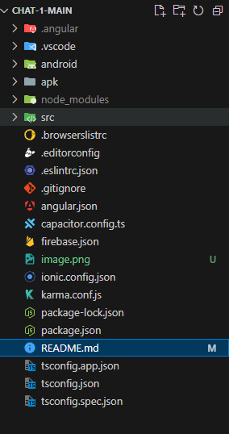
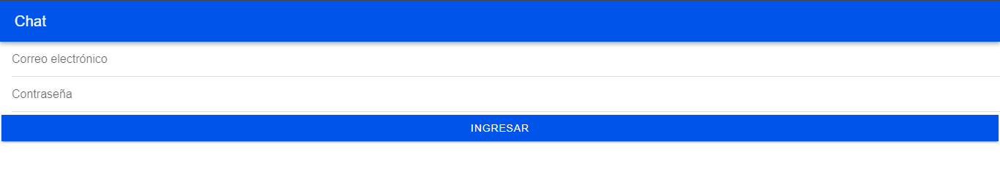

# Chat con Firebase 
## Para que el usuario pueda acceder a este aplicación debe seguir estos pasos.
1. Priemro debera de clonarse este repositorio o descargar el zip del mismo.  

2. una vez echo esto al usuario se le mostrara la estructura de este proyecto.  

3. Debera de ejecutar el comado nmp install para que se obtengan todas las librerias necesarias, una vez echo esto se mostrara un mensaje como este.  

4. Al ingresar al usuario se le mostrara la siguiente pantalla.  
